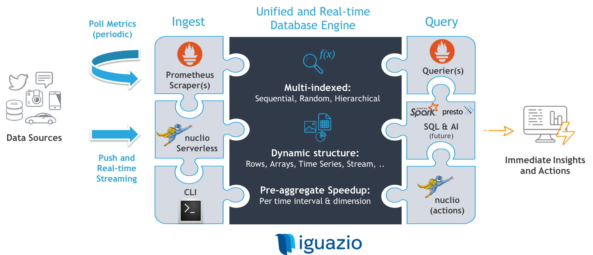

# V3IO-TSDB
iguazio API lib for time-series DB access and Prometheus TSDB storage driver 

> Note: This project is still under development 

## Overview
iguazio provides a real-time flexible document database engine which accelerates popular BigData and open-source 
frameworks such as Spark and Presto, as well as provide AWS compatible data APIs (DynamoDB, Kinesis, S3). 

iguazio DB engine runs at the speed of in-memory databases, but uses lower cost and higher density (NVMe) Flash, it has 
a unique low-level design with highly parallel processing and OS bypass which treats Flash as async memory pages. 

iguazio DB low-level APIs (v3io) has rich API semantics and multiple indexing types, those allow it to run multiple
workloads and processing engines on exactly the same data, and consistently read/write the data in different tools.

This project uses v3io semantics (row & col layouts, arrays, random & sequential indexes, etc.) to provide extreamly
fast and scalable Time Series database engine which can be accessed simultaneously by multiple engines and APIs, such as:
- Prometheus TimeSeries DB (for metrics scraping & queries)
- nuclio serverless functions (for real-time ingestion, stream processing or queries) 
- iguazio DynamoDB API (with extensions) 
- Apache Presto & Spark (future item, for SQL & AI)
<br>


<br>

## Architecture
The solution stores the raw data in highly compressed column chunks (using Gorilla/XOR compression variation), with one 
chunk for every n hours (1hr default), queries will only retrieve and decompress the specific columns based on the 
requested time range. 

Users can define pre-aggregates (count, avg, sum, min, max, stddev, stdvar) which use v3io update expressions and store
data consistently in Arrays per user defined intervals and/or dimensions (labels). 

High-resolution queries will detect the pre-aggregates automatically and selectively access the array ranges 
(skip chunk retrieval, decompression, and aggregation) which significantly accelerate searches and provide real-time 
response. an extension supports overlapping aggregates (retrieve last 1hr, 6h, 12hr, 24hr stats in a single request), 
this is currently not possible via the standard Prometheus TSDB API.  

The data can be partitioned to multiple tables (e.g. one per week) or use a cyclic table (goes back to the first chunk after
 it reached the end), multiple tables are stored in a hierarchy under the specified path. 
 
Metric names and labels are stored in search optimized keys and string attributes. iguazio DB engine can run full 
dimension scan (searches) in the rate of millions of metrics per second, or use selective range based queries to access 
a specific metric family. 

The use of v3io random access keys (Hash based) allow real-time sample data ingestion/retrieval and stream processing.      

## How To Use  

see `v3io-tsdb_test.go` for example usage as an embedded library 

it works with the Prometheus fork found in `https://github.com/v3io/prometheus`

For use inside your code or nuclio function you just need to import this package (no need for Prometheus)
, see function example under [\nuclio](nuclio)

to work you need to use a configuration file in the minimal form:

```yaml
v3ioUrl: "<v3io address:port>"
container: "tsdb"
path: "metrics"
verbose: false
workers: 8
```
